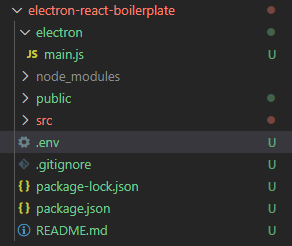
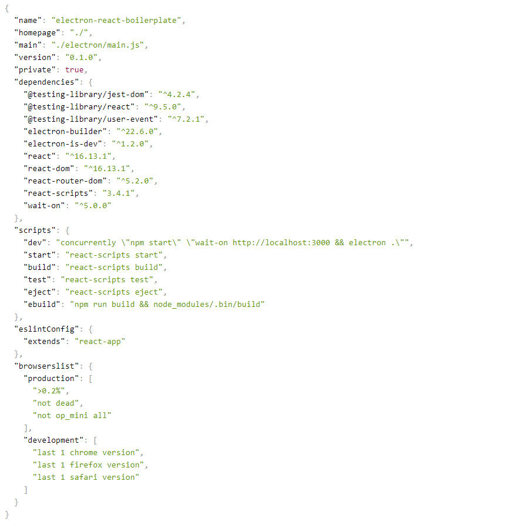

# Tutorial de integração React JS + Electron

### Instale as dependências do React

    npm install react –save
    npm install react-dom - save
    npm install react-router-dom - save
    npx create-react-app

### Escrevendo seu primeiro aplicativo Electron React:

Vamos criar um clichê de reação de elétrons que pode ser reutilizado para aplicações de reação.
Para começar, vamos instalar o construtor de elétrons, elétron e espera:

1. Construtor de elétrons: É necessário ter um construtor de elétrons para suas aplicações de elétrons. Ele empacota e constrói o aplicativo para criar aplicativos "prontos para distribuição" para Windows, macOS e Linux.

2. Wait-on: Adicionaremos o wait-on ao host local antes de criar um aplicativo de elétrons. Assim, certificando-se de que o servidor webpack seja executado antes do app electron:

```
npm install electron electron-builder wait-on
npm install electron-is-dev concurrently
```

Crie uma nova pasta como "Electron" e crie o arquivo main.js.

Electron-is-dev: permite que você depure seu código durante o desenvolvimento. Ele pode ser usado no processo principal e renderizado.

    const { app, BrowserWindow } = require('electron');
    const isDev = require('electron-is-dev');
    const path = require('path');

    let mainWindow;

    function createWindow() {
        mainWindow = new BrowserWindow({
            width:800,
            height:600,
            show: false
        });
        const startURL = isDev ? 'http://localhost:3000' : `file://${path.join(__dirname, '../build/index.html')}`;

        mainWindow.loadURL(startURL);

        mainWindow.once('ready-to-show', () => mainWindow.show());
        mainWindow.on('closed', () => {
            mainWindow = null;
        });
    }
    app.on('ready', createWindow);

Primeiro, vamos definir as dimensões do BrowserWindow para criar uma janela para nosso aplicativo de elétrons. A seguir, vamos configurar o "startURL". Antes de definir o "startURL", vamos verificar se a aplicação está rodando em modo de desenvolvimento ou modo de produção. Como estamos no modo de desenvolvimento, vamos configurá-lo para localhost.

Configure o script para executar o aplicativo em um navegador. Adicione o script ebuild para construir o aplicativo, isso constrói o aplicativo no caminho fornecido.

    "ebuild": "npm run build && node_modules/.bin/build"

Adicione o dev script, para executar o aplicativo Web e o aplicativo eletrônico ao mesmo tempo. Usaremos o pacote Concurrently de npm que executa vários comandos npm.

    "dev": "concurrently \"npm start\" \"wait-on http://localhost:3000 && electron .\"",

Agora defina o campo principal para a inicialização do aplicativo. O script em main.js iniciará o aplicativo. Caso o arquivo principal não seja adicionado, o aplicativo será iniciado a partir de index.js.

    "homepage": "./",
    "main": "./electron/main.js",

Crie um arquivo .env para passar as variáveis ​​de ambiente do aplicativo.

    //.env
    BROWSER=none

Sua estrutura de pastas será semelhante à imagem a seguir após adicionar o arquivo .env.



Este é o arquivo package.json completo:



Para executar o aplicativo React no navegador e em uma janela separada, execute o seguinte comando:

    npm run dev

# Build SOs

### Para uso em scripts npm (recomendado)

    npm install electron-packager --save-dev

### Instale também o CLI global

    npm install electron-packager -g

## Windows

Para gerar o executável para Windows com arquitetura ia32, execute:

    npm run win32

- Neste caso deve se considerar a estrutura do nosso arquivo package.json

**ou**

    electron-packager . myApp --platform=win32 --arch=ia32

Neste caso altere myApp para o nome de sua aplicação.

x64

    npm run win64

- Neste caso deve se considerar a estrutura do nosso arquivo package.json

**ou**

    electron-packager . myApp --platform=win32 --arch=x64

## Linux

Para empacotar o seu programa para ser executado em sistemas operacionais Linux execute um dos os comandos a seguir no seu terminal usando linux32 ou ia32 para arquitetura 32 bits e linux64 ou x64 para arquitetura 64 bits.

    npm run linux64

- Neste caso deve se considerar a estrutura do nosso arquivo package.json

**ou**

    electron-packager . myApp --platform=linux --arch=x64

## Mac OS

Para empacotar sua aplicação para rodar em OSX execute um dos comandos a seguir no seu terminal:

    npm run osx

- Neste caso deve se considerar a estrutura do nosso arquivo package.json

**ou**

    electron-packager . myApp --platform=darwin --arch=x64
